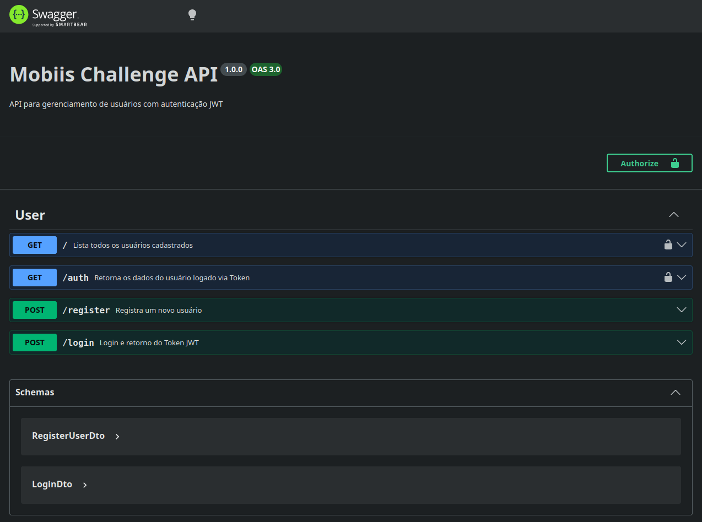

# Desafio Técnico para Desenvolvedor Back-End - Mobiis

<p align="center">
  
</p>

## 📍 Objetivo
Criar uma _API_ simples para gerenciar usuários, usando autenticação.

## 📜 Sumário

1. [🧰 Ferramentas](#-ferramentas)
2. [🔙 Configurando o ambiente](#-configurando-o-ambiente)
3. [🐋 Usando Docker](#-usando-docker)
4. [📖 Usando Swagger](#-usando-swagger)

## 🧰 Ferramentas
O seguinte desafio foi realizado com as seguintes ferramentas e SO:


## ⚙️ Configurando o ambiente

### Variáveis de ambiente

Crie um arquivo `.env` para suas variáveis de ambiente que contenham os seguintes dados:

#### Caso você esteja usando Windows, pule para a parte de escrita do arquivo.

Abra o terminal e crie o arquivo:

```bash
$ touch .env
$ vim .env  # OU nano .env
```

Então escreva e salve:

```bash
MONGO_ROOT_USER=<seu_usuario_root>
MONGO_ROOT_PASSWORD=<senha_do_seu_usuario_root>
MONGO_PORT=<sua_porta_do_mongo>
MONGODB_URI=<sua_url_do_mongo>
PORT=<sua_porta_da_api>
JWT_SECRET=<seu_segredo_jwt_aqui>
```

> Exemplo:
> ```bash
> MONGO_ROOT_USER=root
> MONGO_ROOT_PASSWORD=password
> MONGO_PORT=27017
> MONGODB_URI=mongodb://root:password@db:27017/mobiis-db?authSource=admin
> PORT=3000
> JWT_SECRET=secret_here
> ```

Depois continue com o processo de instalação e execução do sistema

```bash
$ pnpm install  # ou somente 'pnpm i'
$ pnpm run build
$ pnpm run start
```

## 🐋 Usando Docker

### Usando a partir do Docker Compose

Rode no terminal:

```bash
$ docker compose up --build
```

## 📖 Usando Swagger

Para acessar o Swagger, basta acessar pelo link: `http://localhost:${PORT}/api-docs/#/` ou http://localhost:3000/api-docs/#/

### Passo a passo para testar

Ao acessar o Swagger, você irá se deparar com a seguinte tela:

<p align="center">
  
</p>

A ordem para testar será a seguinte:

- `POST - /register`: Rota que será usada para registrar um novo usuário.
    - Corpo da Requisição:
    ```
        "document": "string",
        "docType": "CPF",
        "password": "string" 
- `POST - /login`: Rota que será usada para acessar usando um usuário criado.
    - Corpo da Requisição:
    ```
        "document": "string",
        "docType": "CPF",
        "password": "string"
- `Authorize`: Deverá inserir aqui o Bearer Token para poder usar as próximas rotas.  
    - O Bearer Token virá na `key` ao realizar o login chamada `token`.
    - Após inserir no campo de Valor e clicar em Autenticar, siga para a rota `/auth` para testar seu usuário.
- `GET - /auth`: Retorna os dados do usuário logado via Token. 
    - Corpo da Resposta:
    ```
        "id": "string", 
        "document": "string", 
        "docType": "CPF" 
- `GET - /`: Lista todos os usuários cadastrados.
    - Corpo da Resposta:
    ```
    [
        "id": "string";
        "document": "string";
        "docType": "string";
    ]